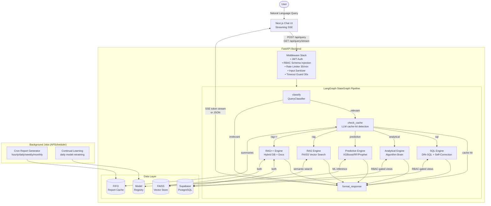

# UQS Architecture

## Full Data-Flow Diagram



## RBAC Security Contract

```
Role         → DB Views Accessible
────────────────────────────────────────────────────────────────
admin        → all views (*)
analyst      → analyst_sales_view, analyst_kpi_view
reg_manager  → rm_sales_view, rm_customer_view
auditor      → audit_trail_view
viewer       → dashboard_summary_view
────────────────────────────────────────────────────────────────

Enforcement chain:
  JWT token (role field)
    → rbac.py loads schema for that role ONLY
    → schema injected into LLM system prompt
    → LLM physically cannot reference other tables
    → SQL safety check blocks DML/DDL regardless
```

## LangGraph State Machine

```
UQSState = TypedDict {
  query, session_id, session, audit, user     ← inputs
  query_type, relevant, polite_rejection      ← from classify
  cache_hit, cache_answer, cache_source       ← from check_cache
  engine_answer, engine_sources, engine_chart ← from engine nodes
  final_response                              ← assembled by format
  error, retry_count                          ← error handling
}

Node timeout: 28 seconds each
Cache check timeout: 5 seconds (fast-fail safe)
```

## Cache FIFO Policy

```
Granularity  Retention  Eviction
──────────────────────────────────
hourly       10 units   FIFO
daily        10 units   FIFO
weekly       10 units   FIFO
monthly      10 units   FIFO

When the 11th unit is added, the oldest (1st) is deleted.
LLM compares incoming query against cache summaries
to determine semantic cache hit (not exact-match).
```

## SQL Self-Correction Loop

```
NL Query
  → Schema linking (identify relevant views)
  → LLM generates SQL
  → Safety check (expanded blocklist)
  → Execute against DB
  ↓ if error:
  → Feed error message back to LLM
  → LLM corrects SQL
  → Execute again
  ↓ if 2nd failure:
  → Return graceful error message
```

## Predictive Engine — Model Selection

```
Task detected → Training pool:
  regression   → [XGBoost, RandomForest, LightGBM]  → lowest RMSE wins
  classification → [XGBoost, RF, LightGBM]           → highest F1 wins
  forecasting  → [Prophet, ARIMA]                    → lowest MAE wins
  clustering   → [KMeans, DBSCAN]                    → highest silhouette wins
  anomaly      → [IsolationForest]                   → auto

Daily retraining:
  new model trained → metrics compared → auto-promote if improved
                                      → rollback retained if not
```
